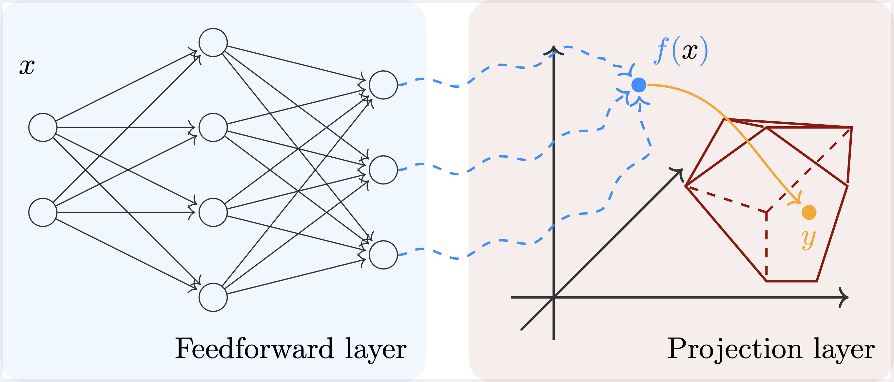

# Hard-Constrained Neural Networks with Iterated Projection Layers



[Paper]() | Authors: Panagiotis Grontas, Antonio Terpin

## Index
- [Usage](#usage)
- [Contributing](#contributing)
  - [Development workflow](#development-workflow)
  - [Testing a feature](#testing-a-feature)
  - [Code organization](#code-organization)
  - [Preparing for a PR](#preparing-for-a-pr)

## Usage
**Note**: The following is a sketch of how we envision the package to be used, and may be subject to changes. For the installation instructions for development, see [Contributing](#contributing).

To install the package, run
```bash
pip install hcnn jax flax
```
Note that our package is integrated with flax.

Below is an example on how to incorporate our projection layer into a simple multi-layer perceptron.
```python
import jax.numpy as jnp
from flax import linen as nn
from typing import Callable, Sequence
from hcnn.constraints import PositiveOrthant

class ConstrainedMLP(nn.Module):
    """
    Simple Multi-Layer Perceptron with a Projection Layer.
    """
    dim_hidden: Sequence[int]
    act_fn: Callable = nn.softplus
    constraint_set:

    def setup(self):
        num_hidden = len(self.dim_hidden)

        layers = list()
        for i in range(num_hidden):
            layers.append(nn.Dense(features=self.dim_hidden[i]))
        layers.append(nn.Dense(features=1))
        layers.append(nn.Project(constraint=PositiveOrthant))
        self.layers = layers

    @nn.compact
    def __call__(self, x):
        for layer in self.layers[:-1]:
            x = self.act_fn(layer(x))
        y = self.layers[-1](x)
        return y
```

## Contributing
We will use [conda](https://conda.io/en/latest/user-guide/install/) to handle the virtual environment for development.
```sh
conda create -n hcnn python=3.10
conda activate hcnn
```

To install the requirements, run:
```sh
pip install pip --upgrade
pip install -e .[dev,cuda12]
```
To not install cuda related things, just omit it.

The `Coding style validation` action will fail if the pre-commit checks do not pass. To make sure that these are checked automatically on push, run:
```sh
pre-commit install --hook-type pre-push
```
To run the pre-commit checks on specific files:
```bash
pre-commit run --files <files>
```
If for some reason you really want to ignore them during commit/push, add `--no-verify`.

To ease writing commit messages that conform to the [standard](https://www.conventionalcommits.org/en/v1.0.0/#summary), you can configure the template with:
```bash
git config commit.template .gitmessage
```
To fill in the template, run
```bash
git commit
```
When you have edited the commit, press `Esc` and then type `:wq` to save. In `Visual Studio Code`, you should setup the editor with
```bash
git config core.editor "code --wait"
```
You may need to [setup the `code` command](https://code.visualstudio.com/docs/setup/mac).
The `Commit style validation` action will fail if you do not adhere to the recommended style.

Tip: When something fails, fix the issue and use:
```bash
git commit --amend
git push --force
```

### Development workflow
We follow a [Git feature branch](https://www.atlassian.com/git/tutorials/comparing-workflows/feature-branch-workflow) workflow with test-driven-development. In particular:

- The basic workflow is as follows:
  1. Open an issue for the feature to implement, and describe in detail the goal of the feature. Describe the tests that should pass for the feature to be considered implemented.
  2. Open a branch from `dev` for the feature:
    ```bash
    git checkout dev
    git checkout -b feature-<issue-number>
    ```
  3. Add the tests; see [Testing](#testing-a-feature).
  4. Implement the feature and make sure the tests pass.
  5. Open a PR to the `dev` branch. Note that the PR requires to `squash` the commit. See [Preparing for a PR](#preparing-for-a-pr).
  6. Close the branch.

- `main` and `dev` branches are protected from push, and require a PR.
- We run github actions, [code-style](https://github.com/antonioterpin/hcnn/blob/main/.github/workflows/code-style.yaml) and [tests](https://github.com/antonioterpin/hcnn/blob/main/.github/workflows/tests.yaml) to check the test status on push on any branch. The rationale is that we want to know the state of each feature without polling the developer.
- We open a PR to `main` only for milestones.

### Testing a feature
To test a new feature, simply add a `test_<feature_to_test>` inside the folder `src/test`. For this, refer to the [`pytest` documentation](https://docs.pytest.org/en/stable/).

To run the tests,
```bash
PYTHONPATH=src pytest
```

### Code organization
We structure the codebase as follows:
- `src/hcnn/` contains the different features of the project.
- `src/hcnn/flax_project.py` contains the `nn.Module` extension to include the project as part of the [flax](https://flax.readthedocs.io) library.
- `src/test/` contains the tests.

### Preparing for a PR
Before opening a PR to `dev`, you need to `squash` your commits into a single one. First, review your commit history to identify how many commits need to be squashed:
```bash
git log --oneline
```
For example, you may get
```bash
abc123 Feature added A
def456 Fix for bug in feature A
ghi789 Update documentation for feature A
```
Suppose you want to squash the three above into a single commit, `Implement feature <issue-number>`. You can rebase interactively to squash the commits:
```bash
git rebase -i HEAD~<number-of-commits>
```
For example, if you want to squash the last 3 commits:
```bash
git rebase -i HEAD~3
```
An editor will open, showing a list of commits:
```bash
pick abc123 Feature added A
pick def456 Fix for bug in feature A
pick ghi789 Update documentation for feature A
```
- Keep the first commit as `pick`.
- Change `pick` to `squash` (or `s`) for the subsequent commits:
```bash
pick abc123 Feature added A
squash def456 Fix for bug in feature A
squash ghi789 Update documentation for feature A
```
Save and close the editor.
Git will prompt you to edit the combined commit message. You’ll see:
```bash
# This is a combination of 3 commits.
# The first commit's message is:
Feature added A

# The following commit messages will also be included:
Fix for bug in feature A
Update documentation for feature A
```
Edit it into a single meaningful message, like:
```bash
Add feature A with bug fixes and documentation updates
```
Save and close the editor; Git will squash the commits. If there are conflicts during the rebase, resolve them and continue:
```bash
git rebase --continue
```
Verify the commit history:
```bash
git log --oneline
```
You should see one clean commit instead of multiple. If you’ve already pushed the branch to a remote repository, you need to force-push after squashing:
```bash
git push --force
```
Now that the feature branch has a clean history, create the PR from your feature branch to the main branch. The reviewers will see a single, concise commit summarizing your changes. See the [guidelines for commit messages](https://www.conventionalcommits.org/en/v1.0.0/#summary).

## Citation
If you use this code in your research, please cite our paper:
```bash
   @inproceedings{grontas2025hccn,
     title={Hard-Constrained Neural Networks with Iterated Projection Layers},
     author={Grontas, Panagiotis and Terpin, Antonio},
     booktitle = {Advances in Neural Information Processing Systems},
     year={2025}
   }
```
