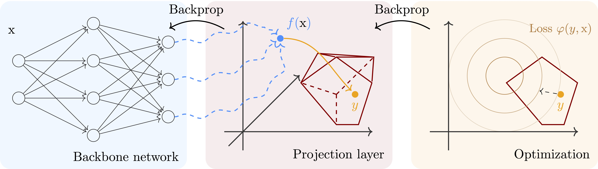

# &Pi;net: Optimizing hard-constrained neural networks with orthogonal projection layers

[](https://arxiv.org/abs/2407.12345)
[](https://github.com/antonioterpin/pinet/stargazers)
[](https://github.com/antonioterpin/pinet/LICENSE)
[](https://codecov.io/gh/antonioterpin/pinet)
[](https://github.com/antonioterpin/pinet/actions/workflows/test.yaml)
[](https://pypi.org/project/pinet-hcnn)

[](https://www.linkedin.com/in/panagiotis-grontas-4517b0184)
[](https://twitter.com/antonio_terpin)



This repository contains a [JAX](https://github.com/jax-ml/jax) implementation of &Pi;net, an output layer for neural networks that ensures the satisfaction of specified convex constraints.

> [!NOTE] TL;DR
> &Pi;net leverages operator splitting for rapid and reliable projections in the forward pass, and the implicit function theorem for backpropagation. It offers a *feasible-by-design* optimization proxy for parametric constrained optimization problems to obtain modest-accuracy solutions faster than traditional solvers when solving a single problem, and significantly faster for a batch of problems.

## Index
- [Getting started](#getting-started)
- [Examples](#examples)
- [Contributing](#contributing-☕️)
- [Citation](#citation-🙏)

## Getting started
To install &Pi;net, run:
- CPU-only (Linux/macOS/Windows)
  ```bash
  pip install pinet-hcnn
  ```
- GPU (NVIDIA, CUDA 12)
  ```bash
  pip install "pinet-hcnn[cuda12]"
  ```

> [!WARNING] CUDA dependencies
> .....

We also provide a working [Docker](https://docs.docker.com/) image to reproduce the results of the paper and to build on top.
```bash
docker compose build
docker compose ...
```


### Supported platforms 💻
|        | Linux x86\_64 | Linux aarch64 | Mac aarch64 | Windows x86\_64 | Windows WSL2 x86\_64 |
| -------------- | ------------- | ------------- | ----------- | --------------- | -------------------- |
| **CPU**        | ✅           | ✅           | ✅         | ✅             | ✅                  |
| **NVIDIA GPU** | ✅           | ✅           | n/a         | ❌              | ❌         |


## Examples

### A toy example: Approximating a MPC controller


> [!TIP] custom
> **TITLE**?<br/>
> Another line

### Works using &Pi;net ⚙️
We collect here applications using &Pi;net. Please feel free to open a pull request to add yours! 🤗

Title | Link
--|--
Multi-vehicle trajectory optimization with non-convex preferences | [](https://github.com/antonioterpin/glitch)


## Contributing ☕️
Contributions are more than welcome! 🙏 Please check out our [contributing page](.CONTRIBUTING.md), and feel free to open an issue for problems and feature requests⚠️.

## Benchmarks 📈


## Citation 🙏
If you use this code in your research, please cite our paper:
```bash
   @inproceedings{grontas2025pinet,
     title={Pinet: Optimizing hard-constrained neural networks with orthogonal projection layers},
     author={Grontas, Panagiotis and Terpin, Antonio and Balta C., Efe and D'Andrea, Raffaello and Lygeros, John},
     journal={arXiv preprint arXiv:TODO},
     year={2025}
   }
```
